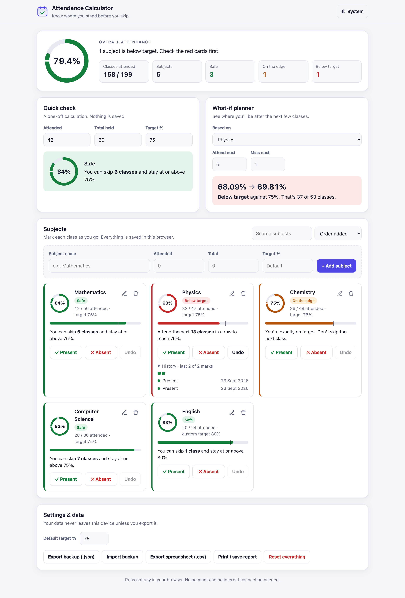
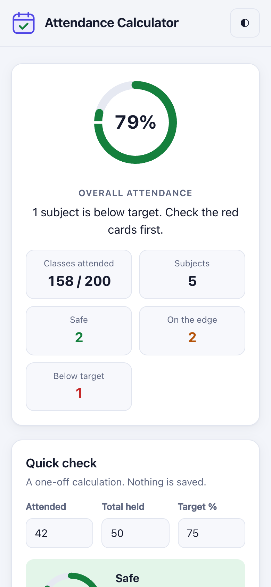
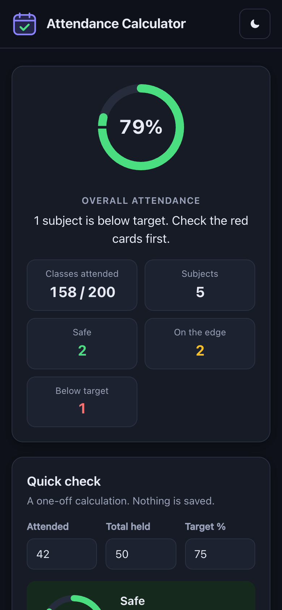
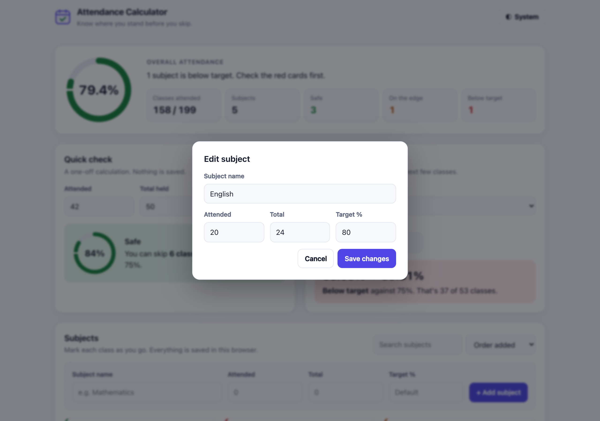

# Attendance Calculator

A small web app for students. It shows your attendance percentage, tells you how many classes you can skip or need to attend to meet a target (such as 75%), and tracks attendance for each subject.

It runs entirely in the browser. There's nothing to install, no account and no server, and your data stays on your device.



---

## Contents

1. [Features](#features)
2. [Getting started](#getting-started)
3. [How to use it](#how-to-use-it)
4. [How the calculations work](#how-the-calculations-work)
5. [Your data and privacy](#your-data-and-privacy)
6. [Project structure](#project-structure)
7. [For developers](#for-developers)
8. [Troubleshooting](#troubleshooting)
9. [Limitations and ideas](#limitations-and-ideas)

---

## Features

| Area | What it does |
|---|---|
| **Overview** | Overall attendance across all subjects, a progress ring and counts of subjects that are *Safe*, *On the edge* and *Below target*. |
| **Quick check** | Enter attended, total and target %. You instantly see your percentage and how many classes you can skip or must attend. Nothing is saved. |
| **What-if planner** | "If I attend the next 5 and miss 1, where will I be?" Works from the Quick check numbers, one subject or all subjects combined. |
| **Subject tracker** | Add subjects with their existing counts, then mark each class **Present** or **Absent** with one click. |
| **Per-subject targets** | Each subject can have its own target (for example 80% for a lab) or use the default. |
| **History** | Every mark is saved with its date. Open a card's *History* to see recent marks and a colour strip of the last 30. |
| **Undo** | Undo the last mark on a subject. Deleting a subject, importing a backup or resetting everything can be undone from the pop-up message. |
| **Edit** | Fix a subject's name, counts or target at any time. |
| **Search & sort** | Filter subjects by name. Sort by name, lowest % first or highest % first. |
| **Themes** | System, Light or Dark. The choice is remembered. |
| **Backup & restore** | Export everything to a `.json` file and import it on another device or browser. |
| **Spreadsheet export** | Download a `.csv` with each subject's numbers, status and advice. |
| **Printable report** | Print or *Save as PDF* a clean report of the overview and subject cards. |
| **Responsive** | Works on phones, tablets and desktops. Supports keyboard use and screen readers. |

<div class="screens" markdown="1">




</div>

---

## Getting started

### Run it

1. Download or copy the project folder.
2. Double-click **`index.html`**. It opens in your default browser.

On macOS you can also run this from the project folder:

```bash
open index.html
```

No build step, package manager or internet connection is needed.

### Optional: serve it locally

If you'd rather use a local web server (for example to open it from your phone on the same Wi-Fi):

```bash
python3 -m http.server 8000
# then visit http://localhost:8000
```

> **Note:** Browsers keep saved data separately for each address. Data saved while using `file://.../index.html` won't appear at `http://localhost:8000`, and the reverse is also true. Use **Export backup** and **Import backup** to move it.

### Supported browsers

Current versions of Chrome, Edge, Firefox and Safari (Safari 16.2 or later) on desktop and mobile.

---

## How to use it

### 1. Quick check

Use this for a one-off answer without saving anything.

1. Enter **Attended** (classes you were present for).
2. Enter **Total held** (all classes held so far).
3. Check **Target %** (it starts at your default target, usually 75).

The result box turns green, amber or red and tells you exactly what to do. For example, 42 of 50 classes gives **84%**, and you *can skip 6 classes and stay at or above 75%*.

### 2. What-if planner

1. Choose what to base it on under **Based on**: *Quick check numbers*, *All subjects combined* or a single subject.
2. Enter how many classes you'll **attend next** and **miss next**.

It shows your percentage now and afterwards (for example *68.09% → 69.81%*) and whether that meets the target.

### 3. Tracking subjects

**Add a subject.** Type a name. You can also enter the classes you've already attended and held, and a custom target. Leave the target blank to use the default. Then click **+ Add subject**.

**Mark classes.** On a subject card:

- **✓ Present** adds one attended class and one held class.
- **✕ Absent** adds one held class.
- **Undo** reverses the most recent mark on that subject.

**Read the card.** Each card shows:

- a ring and a bar with your percentage (the small mark on the bar is your target),
- a status badge (see the table below),
- one line of advice, such as *"Attend the next 13 classes in a row to reach 75%"*,
- **History**, which lists each mark with its date.

**Edit or delete.** Use the ✎ and 🗑 icons at the top right of a card. After a delete, click **Undo** in the pop-up message within 6 seconds to bring the subject back.

**Find subjects.** Use the search box, or change the sort order to *Lowest % first* to see which subjects need attention.



### 4. What the statuses mean

| Status | Colour | Meaning |
|---|---|---|
| **Safe** | Green | At or above target, and you can skip at least one class. |
| **On the edge** | Amber | At or above target, but skipping the next class would drop you below it. |
| **Below target** | Red | Under target. The advice tells you how many classes to attend in a row. |
| **No classes yet** | Grey | No classes have been marked for this subject. |

### 5. Settings & data

| Control | What it does |
|---|---|
| **Default target %** | Target used by every subject without its own target, by the overview and by the Quick check. |
| **Theme button** (top right) | Switches between *System*, *Light* and *Dark*. |
| **Export backup (.json)** | Downloads all subjects, history and settings. |
| **Import backup** | Loads a backup file and replaces the current data. It asks you first and can be undone. |
| **Export spreadsheet (.csv)** | Downloads a table that opens in Excel, Google Sheets or Numbers. |
| **Print / save report** | Opens the print dialog. Choose *Save as PDF* to keep a copy. |
| **Reset everything** | Deletes all subjects and history, but keeps your settings. It asks you first and can be undone. |

---

## How the calculations work

Let:

- **A** = classes attended
- **T** = total classes held
- **P** = target percentage (1–100)

### Current percentage

```
percentage = A ÷ T × 100
```

### Classes you must attend (when below target)

This is the smallest number **x** of consecutive classes you must attend so that `(A + x) ÷ (T + x) ≥ P ÷ 100`:

```
x = ceil( (P × T − 100 × A) ÷ (100 − P) )
```

If the target is **100%** and you've already missed a class, the target can't be reached, and the app says so.

### Classes you can skip (when at or above target)

This is the largest number **y** of classes you can miss so that `A ÷ (T + y) ≥ P ÷ 100`:

```
y = floor( (100 × A − P × T) ÷ P )
```

### What-if projection

```
new percentage = (A + attendNext) ÷ (T + attendNext + missNext) × 100
```

All comparisons use whole-number arithmetic (for example `A × 100 < P × T` rather than dividing first), so results such as "exactly 75%" aren't affected by floating-point rounding.

### Worked examples (target 75%)

| Attended / Total | Percentage | Result | Check |
|---|---|---|---|
| 42 / 50 | 84% | Can skip **6** | 42 ÷ 56 = 75% ✓ |
| 30 / 50 | 60% | Must attend **30** | 60 ÷ 80 = 75% ✓ |
| 36 / 48 | 75% | On the edge (skip 0) | 36 ÷ 49 = 73.5% ✗ |
| 32 / 47 | 68.09% | Must attend **13** | 45 ÷ 60 = 75% ✓ |

---

## Your data and privacy

- All data is stored in your browser's **`localStorage`** under the key `attendance-app-v2`.
- Nothing is sent over the network. The app makes no network requests at all.
- Data is kept separately for each **browser, device and address**. Clearing site data, or using a private window, removes it. Export a backup regularly if the data matters to you.
- Data from version 1 of the app (key `attendance-subjects`) is imported automatically the first time version 2 opens.

### Backup file format

```json
{
  "version": 2,
  "settings": { "target": 75, "theme": "system" },
  "subjects": [
    {
      "id": "m1abc2de3f",
      "name": "Physics",
      "attended": 32,
      "total": 47,
      "target": null,
      "log": [
        { "t": "p", "d": "2026-09-23" },
        { "t": "a", "d": "2026-09-24" }
      ]
    }
  ]
}
```

| Field | Meaning |
|---|---|
| `target` | The subject's own target, or `null` to use the default. |
| `log[].t` | `"p"` = present, `"a"` = absent. |
| `log[].d` | Date of the mark (`YYYY-MM-DD`, local time). |

Imported files are checked and cleaned before use. Invalid counts are clamped, attended can never exceed total, names are limited to 40 characters and unknown fields are ignored.

---

## Project structure

```
attandacne/
├── index.html        Page structure and the edit dialog
├── style.css         Colours, light/dark themes, layout and print styles
├── app.js            Calculations, saving, rendering and import/export
├── README.md         Short overview
└── docs/
    ├── DOCUMENTATION.md  This documentation
    ├── Attendance-Calculator-Documentation.pdf
    └── images/       Screenshots used in the documentation
```

---

## For developers

### Architecture

The app is plain HTML, CSS and JavaScript with no frameworks or dependencies. `app.js` is organised in sections:

| Section | Responsibility |
|---|---|
| **Core math** | Pure functions with no DOM access: `analyze()`, `project()`, `statusOf()` and `adviceHtml()`. |
| **Helpers** | Input parsing (`readInt`), HTML escaping (`esc`), dates, the SVG ring renderer and file downloads. |
| **State & persistence** | `state` object, `load()`, `save()` and `normalize()`, which validates saved and imported data and migrates version 1. |
| **Toast** | Pop-up messages with an optional *Undo* action. |
| **Theme** | Cycles `system → light → dark` by setting `data-theme` on `<html>`. |
| **Overview / Quick check / What-if / Subjects** | Each has a `render…()` function that rebuilds its part of the page from `state`. |
| **Settings & data** | Default target, JSON export and import, CSV export, print and reset. |

**Data flow.** Every user action changes `state` and then calls `commit()`, which saves to `localStorage` and re-renders everything. The page is always drawn from `state`, so what you see can't drift out of sync with what's saved.

### Key functions

```js
analyze(attended, total, target)   // → { percent, needed, canSkip }
project(attended, total, attend, miss) // → { attended, total, percent }
statusOf(result, target, total)    // → { key: "good"|"warn"|"bad"|"new", label }
normalize(rawJson)                 // → clean state, or throws on unrecognised input
```

### Security notes

- User-entered names are always escaped with `esc()` before being inserted into HTML.
- CSV cells that start with `=`, `+`, `-` or `@` get a leading `'` so spreadsheets don't run them as formulas.
- Imported JSON is never trusted as-is. `normalize()` rebuilds every field.

### Theming

Colours are CSS custom properties on `:root` in `style.css`. Dark values apply in two cases: under `prefers-color-scheme: dark` (unless Light is chosen), and when `data-theme="dark"` is set. To change the palette, edit the token blocks at the top of the file.

### Testing

The app was tested in headless Google Chrome by driving the real page. Each of these scenarios was checked:

- empty state, adding subjects, rejecting duplicate names and attended values greater than total,
- Present / Absent / Undo counts and the advice text,
- overview totals and status counts,
- Quick check results and input errors,
- What-if projection for a single subject,
- search and sort order,
- data surviving a page reload,
- editing a subject, and deleting it and bringing it back with Undo,
- dark theme, and a phone-width layout with no horizontal scrolling,
- no console errors.

The calculation formulas were also checked against the worked examples above.

---

## Troubleshooting

| Problem | Fix |
|---|---|
| My subjects disappeared. | You may be in a different browser, a private window, or opening the page from a different address (`file://` vs `http://`). Import your latest backup. |
| Import says "doesn't look like an attendance backup". | The file must be a `.json` exported by this app (or have a `subjects` array). |
| The theme doesn't change. | *System* follows your device setting. Click the theme button again to pick *Light* or *Dark*. |
| The printed report has no colours. | Turn on **Background graphics** in the print dialog's options. |
| A mark was added by mistake. | Click **Undo** on that subject's card. |

---

## Limitations and ideas

**Current limitations**

- Data isn't synced between devices automatically. Use export and import.
- Marks are dated *today*. You can't choose a past date, but you can adjust the counts with **Edit**.
- There's no timetable, so each class has to be marked by hand.

**Possible next steps**

- Weekly timetable with "mark today's classes" in one tap.
- Choosing a date for each mark, and a calendar view.
- Installable offline app (PWA).
- Charts showing how attendance has changed over time.

---

*Attendance Calculator. Version 2.0, September 2026.*
